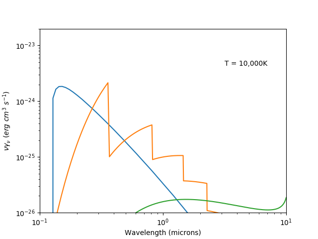
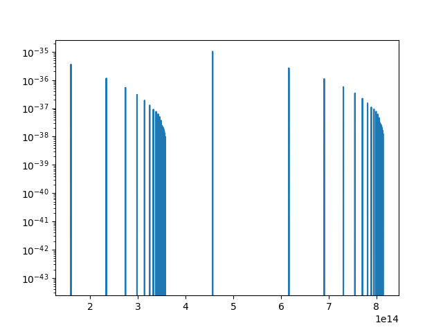

# Questions 4 and 5 on the project + Figure 4.1

## Figure 4.1
Run with `./main.py`. Will pop up a graph that will hopefully look like 4.1 in Osterbrock.
Add your code to plot your emission coefficient. Whether you add the code to compute this or just load pre computed summaries doesn't really matter.
Slack me if you have questions.

Once you are done, save the updated figure and it will show up here!

## Combined Spectrum
Adds up all the components

## Two photons
Run with `python3 two_photon_spectra.py`. Should pop up some plots.

Emission spectrum from two photon emission. Basically,
* The spectrum has a shape in nu/lambda which depends on the probability or releasing photons at various energies. Obvious a photon can't have negative energy or have more than the energy difference between n=2 and n=1 in Hydrogen. This distribution comes from Osterbrock.
* Scale this spectrum by the the number of peturbing particles and some constants to get total emission.

## Hydrogen lines
Run with `python3 hydrogen_lines.py`. Should pop up some plots and also the integration over H beta to show that we get the correct flux.

We are only getting the emission from Balmer and Paschen lines at the moment. This is easy to change (just update `main`). The process looks like:
* For each line, find its width (thermal) and get the emission out to 10 standard deviations
* Stick them all together.

